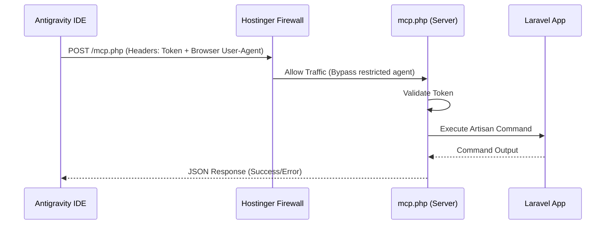

# 🔗 Remote Management via MCP (v7.0)

The **Auto Blog System** now includes a secure, lightweight Model Context Protocol (MCP) server designed specifically for shared hosting environments (like Hostinger). This allows developers and AI agents (like Antigravity) to safely manage the remote server directly from the IDE.

## 🚀 Overview

The MCP integration bypasses common shared hosting limitations (like restricted SSH or lack of daemon support) by providing a stateless HTTP-based bridge to the server's internals.

### Features
- **Remote Command Execution**: Run `php artisan`, `git pull`, and other CLI tools.
- **File Management**: Read, write, list, and delete files remotely.
- **Log Inspection**: Access `laravel.log` or PHP error logs without FTP.
- **WAF Bypass**: Built-in support for custom headers (like User-Agent) to bypass restrictive firewalls.

## 🛡️ Security & Authentication

The MCP server (`public/mcp.php`) is protected by a mandatory secret token:

1.  **Token Verification**: Every request must include an `X-MCP-Token` header.
2.  **Restricted Execution**: Commands are executed within the project root.
3.  **Stateless**: No sessions are maintained; each request is independently authenticated.

## 🛠️ Setup Instructions

### 1. Upload the Server
Ensure `public/mcp.php` is uploaded to your server's web root.

### 2. Configure the Secret
Edit `public/mcp.php` on the server and change the `SECRET_TOKEN` constant:
```php
define('SECRET_TOKEN', 'your-random-secure-token');
```

### 3. Connect from Antigravity IDE
Add the MCP server to your local configuration:

```bash
antigravity mcp add \
  --transport http \
  --header "X-MCP-Token: your-random-secure-token" \
  --header "User-Agent: Mozilla/5.0 (Windows NT 10.0; Win64; x64) AppleWebKit/537.36 (KHTML, like Gecko) Chrome/120.0.0.0 Safari/537.36" \
  hostinger-mcp \
  https://your-blog-domain.com/mcp.php
```

> [!IMPORTANT]
> **WAF Note**: If you receive 403 Forbidden errors (common on Hostinger), ensure you include a standard browser `User-Agent` string in your headers as shown above.

## 📖 Command Reference

Once connected, you can run commands remotely:

| Tool | Usage |
| :--- | :--- |
| `run_command` | `git pull origin main` |
| `run_command` | `php artisan blog:cleanup-unicode --force` |
| `read_file` | `path: ".env"` |
| `list_dir` | `path: "storage/logs"` |

## 🔄 Integration Flow



---
*For general project documentation, see the [README.md](README.md).*
